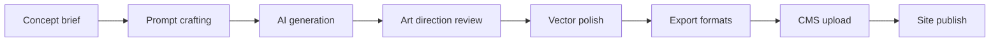

# Neon Cyberpunk Illustration Concepts for BWAI Blog

## Architecture Overview
- Theme: Collective braintrust illuminating a futuristic skyline with code-driven energy grids.
- Scene: Elevated plaza where diverse makers sculpt a glowing holographic city map labelled with Eleventy, Page-CMS, and Cloudflare nodes.
- Palette: Electric cyan, violet, and magenta over a deep midnight gradient.
- Motion cues: Light trails linking teammates, forming the outline of the BWAI logo.
- Possible placement: Site hero or About page lead visual.

## Content Management Structure
- Theme: Data streams weaving into a shared knowledge archive.
- Scene: Neon-lit library with levitating markdown files and navigation cards orbiting a central core labelled content, includes, data, public.
- Palette: Turquoise data streams with amber highlights.
- Motion cues: Animated glyphs representing folders folding into a unified tree.
- Possible placement: Section explaining repo structure or contributor onboarding page.

## Page-CMS Integration
- Theme: Portal between creators and content pipeline.
- Scene: Futuristic control room where contributors slot glowing content cubes into a CMS gateway connected to the blog timeline.
- Palette: Magenta portals with teal circuitry.
- Motion cues: Flowing path from CMS console to published posts.
- Possible placement: Explainer on editorial workflow or CMS documentation.

## Template System
- Theme: Modular holo-panels snapping into responsive layouts.
- Scene: Designers rearranging transparent panels labelled base, home, post while neon threads ensure accessibility and performance metrics stay stable.
- Palette: Cyan panels with coral and lime accent icons.
- Motion cues: Panels sliding into place, leaving light echoes shaped like brackets.
- Possible placement: Technical primer on templating or component library section.

## Deployment and Build Configuration
- Theme: Launchpad propelling builds into the cloud.
- Scene: Cyberpunk hangar where launch technicians upload Eleventy builds to Cloudflare orbits, with retired Netlify shuttle in the background.
- Palette: Gold thruster flares against dark violet hangar lights.
- Motion cues: Streaks showing CI stages culminating in a successful deploy badge.
- Possible placement: DevOps or README visuals.

## Key Features and Patterns
- Theme: Control dashboard monitoring performance, SEO, accessibility.
- Scene: Command center with holographic gauges labelled drafts, tags, feeds, image optimization, navigation, accessibility.
- Palette: Emerald metrics with magenta warnings and indigo console.
- Motion cues: Rotating rings highlighting active features and achievements.
- Possible placement: Feature highlights on landing page or investor/community pitch deck.

## Areas for Consideration and Recommendations
- Theme: Forward-looking skyline with upgrade beacons.
- Scene: Visionaries projecting future modules for analytics, i18n, and security onto a sky of floating task nodes.
- Palette: Amber and lavender beacons against a twilight gradient.
- Motion cues: Beacons pulsing in sequence to suggest roadmap progression.
- Possible placement: Roadmap section or community call-to-action banner.

## Global Atmosphere Notes
- Lighting: Blend of ambient city glow with focused rim lighting on collaborators to emphasize community energy.
- Character styling: Inclusive mix of genders, ages, and cultural backgrounds wearing augmented reality visors, streetwear, and wearable tech.
- Iconography: Include subtle 11ty, JS, Cloudflare motifs remixed into neon signage and graffiti.
- Textural cues: Rain-kissed pavement, holographic reflections, and volumetric fog to deepen the vibe.

## Page Placement Suggestions
| Site Area | Visual Concept | Placement Notes |
| --- | --- | --- |
| Homepage hero | Architecture skyline collective | Full-bleed banner with headline overlay and CTA blocks |
| Homepage features strip | Key features dashboard | Horizontal trio of looping snippets behind feature cards |
| About page lead | Content management archive | Wide illustration above mission statement |
| Blog index | Template system panels | Slim header image framing posts list |
| CMS docs | Page-CMS portal | Inline visual next to onboarding steps |
| Roadmap section | Future beacons skyline | Background wash for roadmap timeline |
| Footer or community CTA | Deployment launchpad | Call-to-action strip encouraging contributions |

## Sourcing and Generation Plan
- Asset pipeline: Generate base concepts via text-to-image, refine in vector editor, export responsive variants.
- Licensing: Ensure generated assets meet project usage rights; store prompts and outputs in version control.
- File strategy: Maintain AVIF and WebP exports under `public/img/` with retina resolutions.

### Prompt Library (Neon Cyberpunk)
- Architecture skyline: `neon cyberpunk city plaza of collaborative coders sculpting holographic skyline, vibrant cyan magenta, wide shot, cinematic glow, reflective surfaces`
- Knowledge archive: `futuristic library with levitating markdown files, inclusive developers, neon turquoise data streams, volumetric light, high detail`
- CMS control room: `diverse community engineers guiding radiant content cubes through a portal network, magenta teal palette, holographic UI`
- Layout panels: `floating transparent interface panels labelled base home post, designers arranging them, neon brackets, cyberpunk studio`
- Launchpad: `hangar crew launching glowing data rockets labeled eleventy build cloudflare, gold thrusters, deep violet environment`
- Dashboard: `command center monitoring accessibility seo performance metrics, green holograms, inclusive team, neon noir style`
- Roadmap skyline: `visionaries projecting future upgrades into twilight skyline, amber lavender beacons, atmospheric perspective`

## Production Workflow
